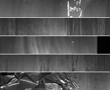
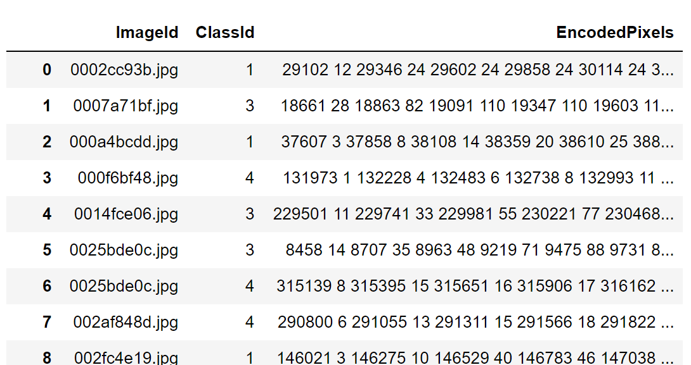
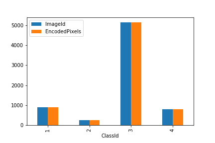
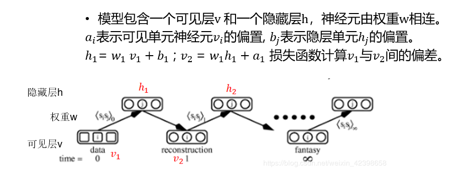
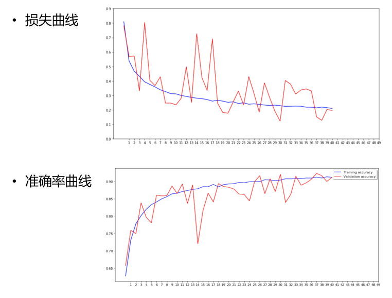
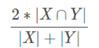
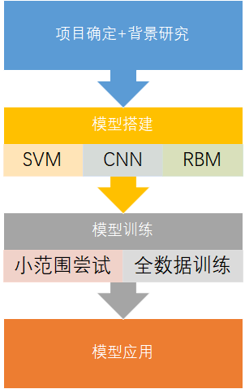

# Steel_surface_defect_detection
Tongji University ML final Assign
## 机器学习与大数据计算 课程期末项目 A组

### 一. 引言
- 项目背景
  - 背景概述：钢铁是现代最重要的建筑材料之一，为了帮助提高钢铁生产效率和质量，通过机器学习高频摄像机的图像来进行钢铁的缺陷识别成为提高自动化水平的重要路径。除了识别，做好钢板上表面缺陷的定位和分类，也有利于提高钢铁的高制造标准，对企业提高市场竞争力有突出作用。
  - 项目来源：该项目主要来源于Kaggle上的一个比赛项目[“Severstal: Steel Defect Detection”](https://www.kaggle.com/c/severstal-steel-defect-detection/overview/evaluation)。
  - 项目简介： 
  钢铁是现代最重要的建筑材料之一，为了帮助提高钢铁生产效率和质量，通过机器学习高频摄像机的图像来进行钢铁的缺陷识别成为提高自动化水平的重要路径。做好钢板上表面缺陷的定位和分类，也有利于提高钢铁的高制造标准、对企业提高市场竞争力有突出作用。
  - 我们的目标：1. 识别缺陷位置；2. 对缺陷类别进行分类。
  - 本项目通过机器学习技术，对钢片缺陷图像进行分类识别，最佳模型缺陷识别精度90.6%。

- 相关研究成果
  - 2015年，Le Cun Y, Bengio Y, Hinton G. 发表了名为 Deep learning 的学术论文，开启了深度学习（DL，Deep Learning）的新时代。
  - Xu Y, Li S L, Zhang D Y 所著的学术论文“Identification framework for cracks on a steel structure surface by a restricted Boltzmann machines algorithm based on consumer‐grade camera images”中研究了如何使用受限玻尔兹曼机（RBM， restricted Boltzmann machines ）来对钢结构当中裂缝的信息进行识别与分类。
  - Xu Y, Bao Y, Chen J 所著学术论文“Surface fatigue crack identification in steel box girder of bridges by a deep fusion convolutional neural network based on consumer-grade camera images ”中研究了融合输入图像多级特征的多通道有向无环图网络实现了钢箱梁微小疲劳裂纹识别。

- 项目意义
  - 学术意义——是一种将机器学习模型在土木工程领域的实际应用探索。
  - 经济意义——由企业现实需求延伸出的研究，优化后可为企业商用，创造经济价值、提升公司效益。
  - 社会效益——在深度改进后可用于日常钢材缺陷检测，借助小程序等软件，未来可为公众提供检测工具。

### 二. 数据集
- 数据集介绍
  -	数据集来源：Kaggle网站“Severstal: Steel Defect Detection”项目
  -	数据集展示（图表）：
   1.	如图1，网站上下载的数据集总共包含四个文件夹，训练集图片、测试集图片、训练集的标记csv文件、最终目标文件格式例子。所有图片都是已经标准化的1600×256像素图片，训练集12568张，测试集5506张。
   2. 如图2，所给训练集是这样一个csv文件,具体属性如下：\
  ImageId（图片名称，若一张图有多个裂缝则该属性会重复出现）\
  ClassId（1-4的整数，分别表示四类裂缝）\
  EncodePixels（以像素位置+长度表示裂缝位置，如：“29102 12”表示从第29102个像素起连续12个像素内容都为裂缝）
   3. 如图3，训练集中属于第3类的裂缝特别突出得多，第2类则最少。所有图片都已经被标记。
   
   
   
   
   
- 数据集标注
  -	数据的训练集是已经标记好的，但是由于是“位置+长度”的rle编码，需要我们利用自定义函数，将其转换为用[0,1]表示的mask编码，同时在输入模型训练时进行扁平化处理。

### 三. 机器学习识别
- 识别算法
  本项目主要采用机器学习分类算法，经过广泛阅览文献、对比研究，采用SVM支持向量机、CNN卷积神经网络进行有监督学习和RBM受限玻尔兹曼机无监督学习的结合。
  -	SVM支持向量机：1963年，弗拉基米尔·万普尼克（前苏联）和亚历克塞·泽范兰杰斯（前苏联）首先提出。考虑将不同类别的数据点分隔开的 𝑝−1 维超平面，取间隔宽度大者为优。\
   · 特点：(1) 最小化经验误差；(2) 最大化决策边界的间距。\
   · 用途：统计分类 (人像识别、文本分类)、回归分析、聚类分析。

  -	CNN卷积神经网络：对卷积神经网络的研究始于二十世纪80至90年代，仿造生物的视知觉机制构建，隐含层内的卷积核参数共享和层间连接的稀疏性使得卷积神经网络能够以较小的计算量对格点化特征（像素、音频等）有稳定的效果。\
   · Input→卷积(convolution)→池化(pooling) →卷积(convolution)→池化(pooling) → …… →扁平化(flatten) 提取特征→全连接层分类→output
   
    
    
  -	RBM受限玻尔兹曼机：玻尔兹曼机是Hinton和Sejnowski于1986年提出的一种根植于统计力学的随机神经网络。RBM是基于此的一种特殊拓扑结构。在降维、分类、协同过滤、特征学习和主题建模中得到应用。可以使用监督学习或无监督学习的方法进行训练。模型包含一个可见层v 和一个隐藏层h，神经元由权重w相连。

    
  
- 模型训练与调参

    

- 模型评估与选择
  - Dice系数（Dice coefficient）：可用于比较预测的分割与其对应的地面真实情况之间的像素方式一致性。公式如下
  
    

    其中X是像素的预测集合，Y是实际真值。也可以叫做骰子系数。

  - 损失loss=‘binary_crossentropy’（二元交叉熵系数）

  - 根据模型训练和超参数调试的结果，具有 Conv2D、 MaxPooling2D、 Dropout等超参数的神经网络模型为钢材缺陷识别问题的最佳模型。

### 四.总结和展望
- 总结
  -	技术流程图：
  
  -	思考讨论：
    - SVM的输入要求是一维的数据，要考虑把rle转mask后进行扁平化处理再进行模型的训练。
    - 所有数据里四个类别的数据量差异极大，经常造成机器破罐子破摔都归到某一类的情况，于是从各类中随机挑选等量进行训练测试。
    - 高像素和大量的数据图片，带来巨大的算量，耗费大量内存和训练时间，故将一部分计算转到服务器上进行，同时在本地先以小范围数据进行尝试。
  
- 展望
  -	本模型在缺陷识别方向的分数不错，但在缺陷类别的分类上还有待提高。
  - 巨大的算量造成模型拟合速度极慢，还来不及进行更多参数和模型选择的尝试。
  - 更进一步的研究方向为通过无监督学习进行钢片缺陷的识别和分类，同时解决图片高像素的运算问题。

